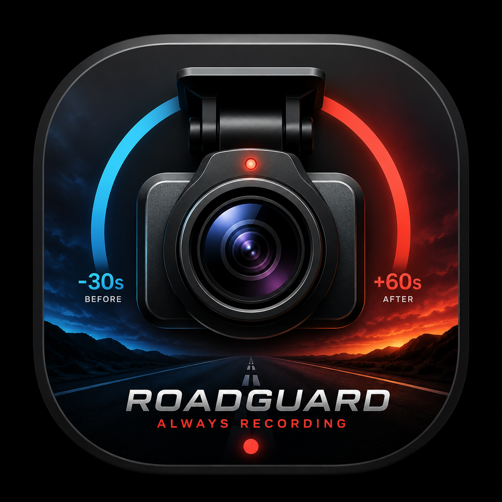

<div align="center">
  
  <h1>Roadguard</h1>
  <p><strong>An offline-first Android dashcam.</strong><br/>
  Records reliably, manages its own heat, never fills your phone, and never sends anything anywhere.</p>
</div>

---

## What it is

A dashcam application for Android 14 and later, built for continuous, unattended recording in a
windscreen cradle. It records in segments, protects footage around detected impacts, shows a
moving map that works with **no SIM and no data connection**, and manages the phone's temperature
so that recording survives a long drive in the sun.

It has no accounts, no cloud, no analytics and no telemetry. Everything stays on the device.

| | |
| --- | --- |
| **Minimum** | Android 14 (API 34) |
| **Target** | Android 16 (API 36), compiled against API 37 |
| **Baseline device** | Motorola Moto G04 — the app is designed to run well on it, not merely to install |
| **Also targeted** | Motorola Edge 60 Fusion |
| **Offline map** | Whole of Australia, installed automatically on first run |
| **Licence** | See [Licensing](#licensing) |

> ### Status: complete and building; **never run on a device**
>
> The application is fully implemented, 368 automated tests pass, Android Lint is clean and both
> APKs build and verify. **It has never been installed on a phone or an emulator** — no device was
> available. So there are no screenshots, no measured benchmarks and no physical thermal
> validation, and this README does not pretend otherwise. [What is and is not
> verified](#what-is-and-is-not-verified) is the honest summary; `docs/testing.md` §5 is the
> detailed one.

## Features

### Recording
- **Segmented loop recording** — 1, 3 (default), 5 or 10-minute segments, oldest-first deletion.
- **Automatic quality** from a runtime capability probe. Not a device database, not a model
  whitelist — probed facts. Auto chooses the highest quality the device can *sustain for hours*,
  which is 720p30 on a low-end phone and 1080p30 on everything else. 4K is available manually,
  with a warning.
- **Normal camera orientation.** Portrait phone → portrait video; landscape phone → landscape
  video. Exactly like the stock camera app, with no invented angle system.
- **Burned-in overlays** — date/time and speed on by default; coordinates and weather available.
- **Microphone off by default**, and the permission is not requested until you turn it on.
- **Recording continues with the screen off**, via a camera foreground service and a partial wake
  lock.

### Event protection
- **Multi-stage impact detection**, not a threshold: rolling history, energy and duration
  features, rejection of vertical-dominated road inputs, rejection of the phone being handled,
  GNSS speed context, then a weighted confidence score.
- **30 s before / 60 s after** an event is protected by default, and protection claims *both*
  segments when an event lands on a boundary.
- **Manual Protect** — one tap, and it outranks every classifier.
- **Near-misses are reported**, with the reason each candidate was rejected, so the sensitivity
  setting is something you can reason about rather than guess at.

### Thermal management
- A dedicated four-level policy engine: `Normal` → `Elevated` → `High` → `Critical`.
- **Recording is never stopped for heat.** The display, map, preview, stabilisation and second
  camera are given up first; recording quality is the last thing to go and recording itself never
  goes.
- Escalation is immediate, de-escalation takes 90 seconds and one step at a time, and every
  recording change lands **at a segment boundary** so nothing is ever truncated.

### Storage safety
- A reserve of `max(1 GiB, 4% of the volume)` that the loop can never spend.
- Default 5 GB loop, configurable, and reported honestly when the device has less room than you
  asked for.
- The two newest segments are never deleted, whatever the arithmetic says.
- Protected footage is never auto-deleted, and video files are **never moved or renamed** — so
  there is no window in which a half-finished move loses the footage an event was protecting.
- Start-up reconciliation repairs five defined filesystem/index divergences, always biased toward
  keeping footage: unverifiable files are quarantined, never deleted.

### Offline maps
- MapLibre rendering a bundled style from a local PMTiles archive. Glyphs and sprites ship inside
  the APK, so **nothing at runtime contacts a tile or font server**.
- The whole-of-Australia archive downloads and installs itself on first run, with progress, pause,
  resume, checksum verification and corruption recovery. You are never asked to find a map file.
- After that: no SIM, no mobile data, no Wi-Fi, and the map still works.

### Interface
- Video and map at roughly 50/50 — stacked in portrait, side by side in landscape, chosen from the
  **actual window size** rather than a hard-coded aspect ratio.
- **Preview zoom is display-only** and provably cannot reach the encoder. The screen says so, in
  words, while you use it.
- Four themes: Light, Dark, System and OLED-black.
- Stock Material icons throughout, fetched verbatim from Google's repository — nothing invented.
- Diagnostics that show *why* Auto chose what it chose, with every value tagged
  `[measured]`, `[inferred]`, `[simulated]` or `[not reported]`.

## Privacy

Two network requests exist in the entire application:

1. the **offline map download**, once; and
2. **weather**, only if you enable it (off by default), sending your position **rounded to about
   1.1 km** and nothing else.

Never sent, under any setting: video, audio, GPS, tracks, telemetry, diagnostics or identifiers.
There is no upload code to disable, no account system, no analytics SDK — and **CI fails the build
if a dependency matching a list of known telemetry SDKs ever appears** on the release classpath.

Full detail, including the complete permission list and how to verify all of this yourself, in
[`docs/privacy.md`](docs/privacy.md).

## Building

```bash
git clone https://github.com/tunlezah/Roadguard.git
cd Roadguard
./gradlew :app:assembleDebug
```

Needs JDK 21 and the Android SDK (platform 37, build tools 37.0.0). Gradle comes from the wrapper,
pinned by version **and SHA-256**.

```bash
./gradlew :app:testDebugUnitTest   # 368 tests
./gradlew :app:lintDebug
./gradlew :app:assembleRelease
```

Release signing is optional and no key is committed; without one, `assembleRelease` falls back to
the Android debug key and stamps the version `-unsigned-release` so CI can publish something you
can actually sideload. See [`docs/build.md`](docs/build.md).

## Documentation

| Document | What is in it |
| --- | --- |
| [`docs/architecture.md`](docs/architecture.md) | Layers, who owns the camera, the segment loop, why there is no DI framework and no codec setting |
| [`docs/research.md`](docs/research.md) | The findings that changed the design, and how each was established |
| [`docs/feature-research.md`](docs/feature-research.md) | Every default and where it came from; what is deliberately not implemented, and why |
| [`docs/thermal-management.md`](docs/thermal-management.md) | Signals, levels, the full mitigation ladder, the test harness |
| [`docs/device-profiles.md`](docs/device-profiles.md) | How a device tier is *earned* from probed facts, and what each tier gates |
| [`docs/storage.md`](docs/storage.md) | The reserve, the budget, what is never deleted, start-up repair |
| [`docs/event-detection.md`](docs/event-detection.md) | Every detector stage, the tuning table, and an honest statement of limits |
| [`docs/offline-maps.md`](docs/offline-maps.md) | PMTiles, the Protomaps Basemap schema, the 18-layer style, installation and recovery |
| [`docs/privacy.md`](docs/privacy.md) | Everything that leaves the device, every permission, how to verify it |
| [`docs/testing.md`](docs/testing.md) | What runs, what it covers, **what is untested**, and a manual test plan |
| [`docs/benchmarking.md`](docs/benchmarking.md) | Calculated figures marked as calculated, and the measurements nobody has taken |
| [`docs/build.md`](docs/build.md) | Toolchain, signing, CI, reproducibility, the lint baseline |
| [`docs/troubleshooting.md`](docs/troubleshooting.md) | Symptom-first, starting with "recording stops when the screen turns off" |
| [`docs/research/`](docs/research/) | The full working research notes — 6,500+ lines, with the evidence trail |
| [`docs/screenshots/`](docs/screenshots/) | Why there are none, and how to capture them |

## What is and is not verified

**Verified, and reproducible from this repository:**

| | |
| --- | --- |
| Automated tests | **368 pass, 0 fail** — including 67 Compose UI tests that run on the JVM |
| Android Lint | clean, against a baseline of four reviewed categories |
| Debug APK | builds, `apksigner verify` passes |
| Release APK | builds (minified, resource-shrunk), `apksigner verify` passes |
| APK contents | `minSdk` 34, `targetSdk` 36, label "Roadguard", ABIs arm64-v8a/armeabi-v7a/x86_64 |
| Offline map archives | all eight published packages verified: PMTiles v3, `mvt`, clustered, and every source-layer the style draws present in each |
| No telemetry dependencies | asserted by CI on every push |

**Not verified, because no device or emulator was available:**

- The app has **never been launched**. Not one frame has been recorded.
- No measured bitrate, storage rate, battery drain, frame rate or rollover gap. Every figure in
  `docs/benchmarking.md` is arithmetic or a build-machine measurement, and is labelled as such.
- **No physical thermal validation.** The thermal harness is explicitly simulated, and everything
  it produces is tagged `[simulated]` all the way to the exported report.
- No drive traces, so the event-detection thresholds are reasoned starting points, not
  measurements.
- No instrumentation tests exist; the opt-in emulator CI job currently has nothing to run.
- **No screenshots**, because fabricating one would be a lie about the product.

The offline map now installs itself on first run from published archives, with no manual step. See
[`docs/offline-maps.md`](docs/offline-maps.md).

## Licensing

| Component | Licence |
| --- | --- |
| Map data | © OpenStreetMap contributors, **ODbL 1.0** |
| Weather data | Open-Meteo, **CC BY 4.0** |
| Material icons | Google, **Apache-2.0** |
| Noto Sans glyphs | **SIL OFL 1.1** |
| MapLibre Native | BSD-2-Clause |
| Application icon | supplied artwork, used as provided and not reinterpreted |

Attribution for the map and weather data is displayed in the app, on the map and on the About
screen, because it is a licence condition rather than a courtesy.

---

<div align="center">
<sub>Roadguard keeps your footage on your phone. That is the whole idea.</sub>
</div>
